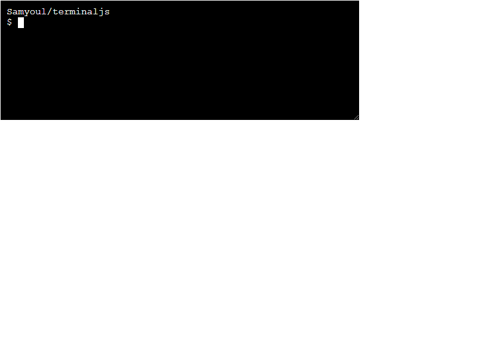

terminaljs
==========

terminal.js is a dead simple JavaScript library for emulating a shell environment.

### Initialization

    var myTerminal = new Terminal(id)

### Properties and methods

    .html
This is the top DOM element of the terminal instance. If you want to modify styling via CSS, all instances belong to a .Terminal class. The element will also get the ID from the constructor argument.

    .print(message)
Prints the message on a new line.

    .input(callback)
Prints shows a prompt where the user can write. When the user presses enter, the callback function fires. The callback takes one argument, which is the user input.

    .clear()
Clears the screen.

    .sleep(milliseconds, callback)
Works exactly like the JavaScript "setTimeout" function. Waits for the number of milliseconds given, then executes the callback.

    .setTextSize()
    .setTextColor()
    .setBackgroundColor()
    .setWidth()
    .setHeight()
All the ".set" methods accepts any CSS-compliant value.

    .blinkingCursor(boolean)
Set to true by default.
